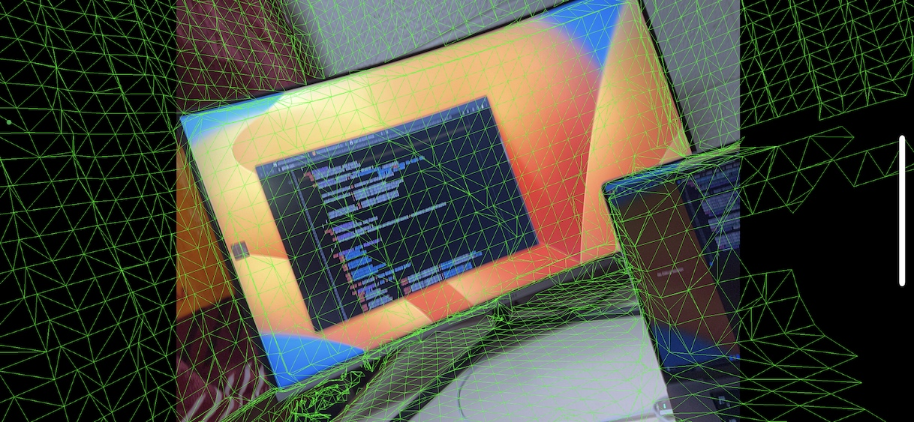

# LiDAR Scanning App

iOS app for scanning a scene and exporting the 3D mesh. This renders the mesh as a green wireframe and exports it when you tap the screen.



Mesh serialization format:

```
UInt32 - Number of vertices
UInt32 - Number of triangles
UInt32 - Number of normals
4 bytes of padding
[SIMD3<Float32>] - Vertices; array of coordinate vectors aligned to 16B
[SIMD3<UInt32>] - Indices; array of triangle index triples aligned to 16B
[SIMD3<Float16>] - Normals; array of direction vectors aligned to 8B
```

## Attribution

Some source files are copied directly from [ARHeadsetKit](https://github.com/philipturner/ARHeadsetKit) without modification.
